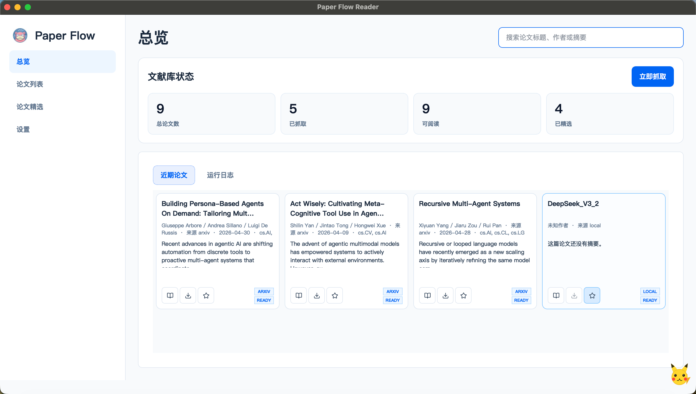
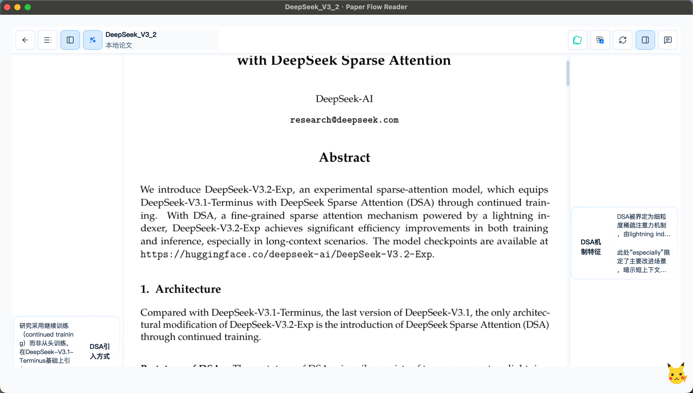
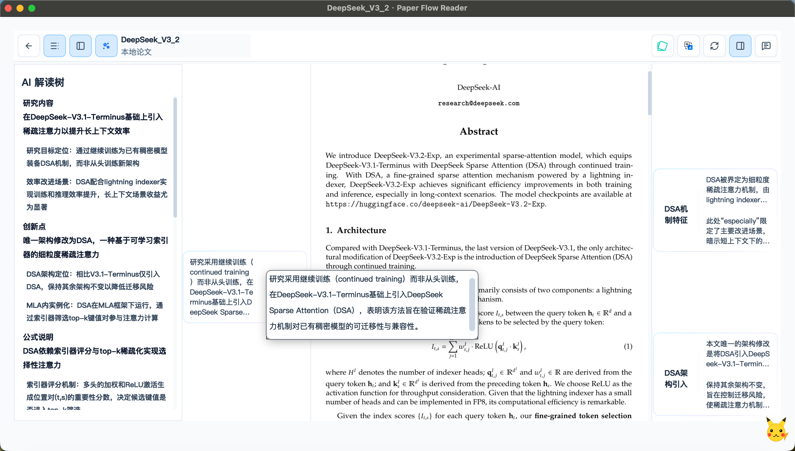
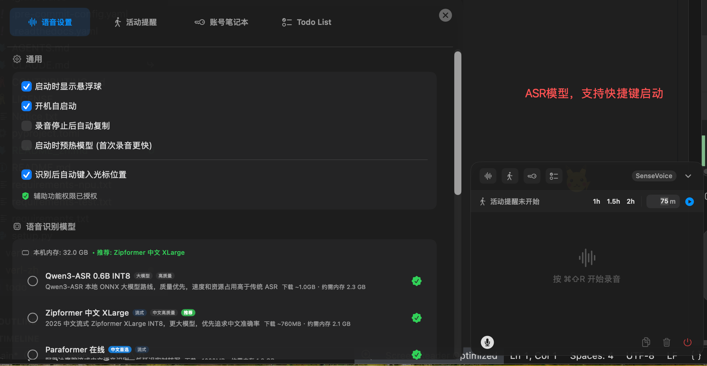
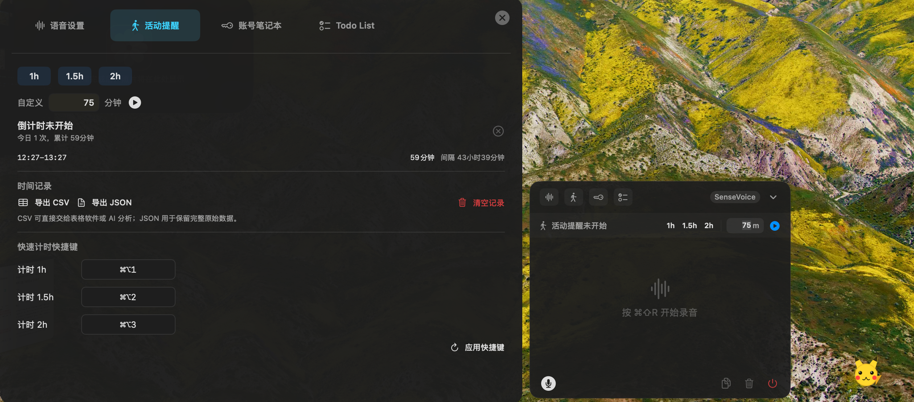
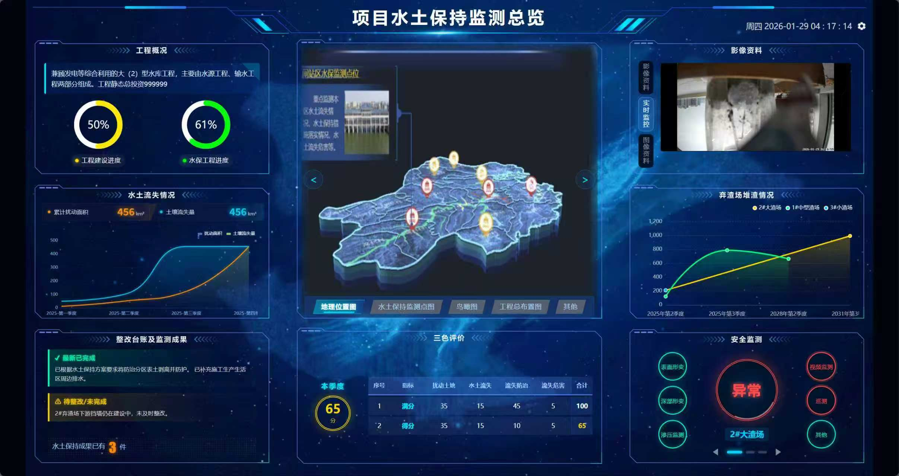

# 项目实现

## 1. 自制Agent系统与最终应用于我博士论文的前端

### 1.1 整体界面

### 1.2 RAG交互示例

### 1.3 Agent交互

#### 多目标优化模型调用

#### 预测模型调用

#### Text2SQL及自主数据分析

## 2. 自制Agent系统与最终应用于我博士论文的前端

### 2.1 主界面

### 2.2 左右两侧卡片

### 2.3 左侧AI解读树

### 2.4 翻译界面

## 3. ASR等功能集成

### 3.1 ASR功能配置

### 3.2 活动提醒

### 3.3 桌面悬浮

## 4. 某三甲设计院水保系统前后端开发

### 大屏

### 5. 自制多端混合现实三维交互系统

## 6. 基于多模态的水利工程智能建设智能体

### 视频演示（有语音）

https://github.com/user-attachments/assets/6895b3aa-1b88-411e-b12a-0396287a66b1

